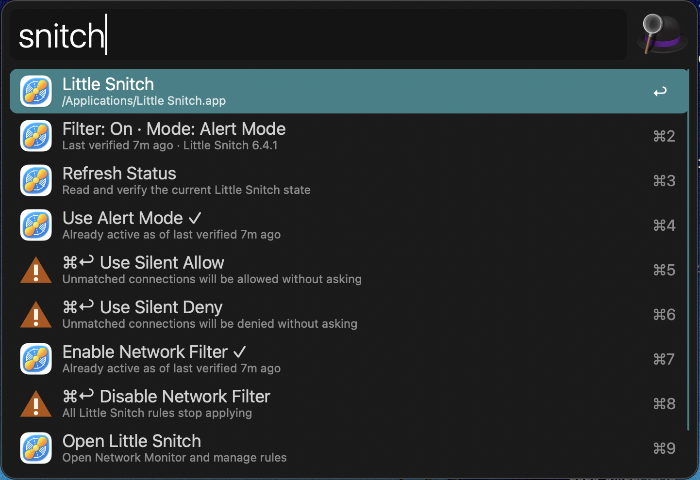

# Alfred Gallery submission notes

The Gallery is invite-only. The sequence is:

1. Publish the repository and a tagged release.
2. Post the workflow in the Alfred forum's
   [Share your Workflows](https://www.alfredforum.com/forum/3-share-your-workflows/)
   section. The submission form requires that thread's URL.
3. If the Alfred team invites a submission, file the issue at
   [alfredapp/gallery-edits](https://github.com/alfredapp/gallery-edits) **and**
   open a pull request there adding
   `workflows/hashkode/little-snitch-control/{readme.md, images/, icon.png}`
   (icon at 256×256).

Requirements this project already satisfies: no auto-updater, no runtime
downloads, no unsigned binaries (scripts are exempt), a user-configurable
keyword of at least three characters, and an icon well above 256×256.

Worth raising explicitly in the forum thread: this workflow requires a paid
third-party app and uses a macOS administrator authorization prompt. Nothing in
the guidelines forbids either, but it is unusual enough to be worth flagging
before a submission.

---

## Draft `readme.md` for the gallery-edits pull request

Written to the [Gallery Style Guide](https://alfred.app/submit/styleguide/):
`## Setup` first for the manual prerequisite, then `## Usage`.

```markdown
## Setup

Little Snitch's command line access is off by default. In Little Snitch, open
Settings → Security, unlock, and enable **Allow access via Terminal**.

Each action asks for your administrator password, because Little Snitch requires
root even to read its current state.

## Usage

Switch Little Snitch's operation mode and network filter via the `snitch`
keyword.



* <kbd>↩</kbd> Refresh the status, switch to Alert Mode, or enable the Network
  Filter.
* <kbd>⌘</kbd><kbd>↩</kbd> Switch to Silent Allow or Silent Deny, or disable the
  Network Filter. These actions weaken filtering, so a plain <kbd>↩</kbd> does
  not trigger them.

The state shown is the last value Little Snitch confirmed, not a live reading.
```
